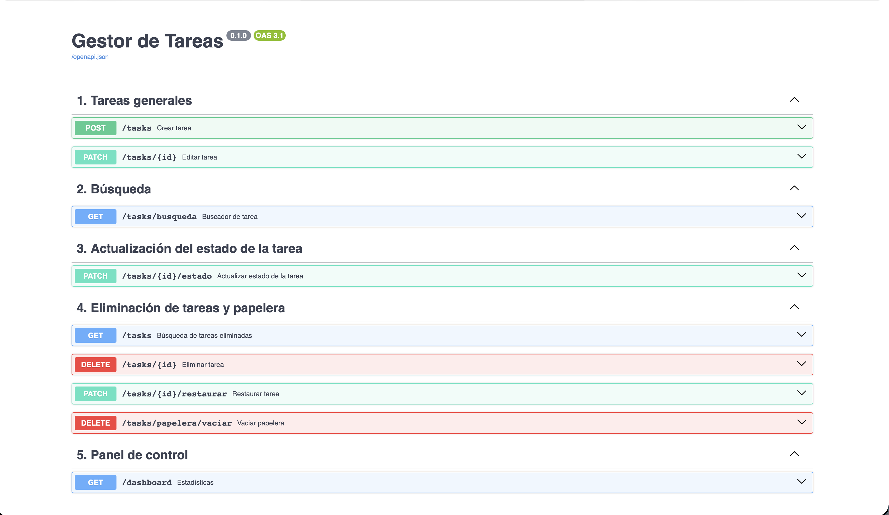

🇪🇸 [Español](#gestor-de-tareas---api-rest-con-fastapi) | 🇬🇧 [English](#task-manager---rest-api-with-fastapi)

---

# Gestor de Tareas - API REST con FastAPI

Este proyecto consiste en el desarrollo de una **API REST con FastAPI** para gestionar una lista de tareas.
Los datos se almacenan en un **archivo JSON local**, sin utilizar una base de datos.

Para el desarrollo del proyecto se plantearon inicialmente unos **endpoints básicos**, pero durante la implementación surgieron varias ideas que aportaban valor al proyecto:

- Borrado lógico
- Búsqueda avanzada por diferentes campos
- Organización de endpoints por categorías
- Sistema de logging
- Escritura segura del JSON con backup

## Tecnologías

| Herramienta | Versión | Función |
|-------------|---------|---------|
| Python | 3.11 | Lenguaje principal |
| FastAPI | latest | Framework para la API REST |
| Pydantic | v2 | Validación de datos y modelos |
| Uvicorn | latest | Servidor ASGI |
| Docker | latest | Contenedor para despliegue |

## Requisitos del sistema

- Python 3.11 o superior
- Docker (opcional, para ejecución en contenedor)
- 512 MB de RAM mínimo

## Instalación y ejecución

### Ejecutar en local
```bash
pip install -r requirements.txt
uvicorn main:app --reload
```

La API estará disponible en `http://localhost:8000`
La documentación interactiva (Swagger) en `http://localhost:8000/docs`

### Ejecutar con Docker
```bash
docker build -t gestor-tareas .
docker run -d -p 8000:8000 gestor-tareas
```

## Interfaz Swagger

La API incluye documentación automática generada por FastAPI mediante Swagger, donde se pueden probar todos los endpoints directamente desde el navegador.



## Estructura del proyecto
```
Proyecto-ToDo-fastapi/
├── main.py          # Endpoints organizados por categorías
├── models.py        # Modelos Pydantic, Enum y validaciones
├── database.py      # Lectura y escritura del JSON + sistema de backup
├── requirements.txt
├── Dockerfile
├── .dockerignore
└── database.json    # Se genera automáticamente al crear la primera tarea
```

## Endpoints disponibles

| Método | Ruta | Descripción |
|--------|------|-------------|
| POST | /tasks | Crear una tarea nueva |
| GET | /tasks | Listar todas las tareas activas |
| GET | /tasks?ver_papelera=true | Ver tareas eliminadas |
| GET | /tasks?ordenar_por=prioridad | Ordenar por prioridad, fecha o vencimiento |
| GET | /tasks/busqueda | Buscar por id, título, prioridad o fechas |
| PATCH | /tasks/{id} | Editar título y/o descripción |
| PATCH | /tasks/{id}/estado | Cambiar el estado de una tarea |
| DELETE | /tasks/{id} | Mover una tarea a la papelera |
| PATCH | /tasks/{id}/restaurar | Restaurar una tarea desde la papelera |
| DELETE | /tasks/papelera/vaciar | Vaciar la papelera definitivamente |
| GET | /dashboard | Ver estadísticas generales |

## Funcionalidades destacadas

**Borrado lógico** — Las tareas eliminadas no se borran del JSON, se marcan como inactivas para poder restaurarlas.

**Búsqueda flexible** — Permite buscar tareas por ID, título, prioridad o fechas.

**Ordenación del listado** — Las tareas pueden ordenarse por prioridad, fecha de creación o fecha de vencimiento.

**Validación de fechas** — La fecha de vencimiento solo acepta el formato `DD-MM-YYYY`. Si el formato no es correcto, la API devuelve un error.

**Estado como Enum** — Los estados posibles son `Pendiente`, `En proceso` y `Completada`, definidos como Enum para evitar valores incorrectos.

**Panel de estadísticas** — El endpoint `/dashboard` muestra el total de tareas y su distribución por estado.

**Logging** — Cada lectura o escritura del JSON queda registrada en consola. Si el archivo está corrupto, el sistema lo restaura desde un backup.

**Escritura segura** — Antes de sobrescribir el JSON se genera una copia de seguridad y se usa un archivo temporal para evitar corrupción.

## Ejemplos de uso
```
POST /tasks
```
```json
{
  "titulo": "Estudiar para el examen",
  "prioridad": "Alta",
  "etiquetas": ["Estudio"],
  "fecha_vencimiento": "01-03-2025"
}
```
```
PATCH /tasks/1/estado
```
```json
{
  "nuevo_estado": "Completada"
}
```
```
GET /tasks/busqueda?titulo=examen
GET /tasks?ordenar_por=prioridad
DELETE /tasks/1
GET /tasks?ver_papelera=true
PATCH /tasks/1/restaurar
DELETE /tasks/papelera/vaciar
```

## Solución de problemas frecuentes

**La API no arranca en local**
Verificar que el entorno virtual está activado y que las dependencias están instaladas con `pip install -r requirements.txt`.

**El archivo JSON aparece corrupto**
El sistema de backup debería restaurarlo automáticamente. Si no es así, eliminar `database.json` y `database.json.bak` y reiniciar la API.

**Docker no encuentra el puerto**
Verificar que el puerto 8000 no está siendo usado por otra aplicación antes de ejecutar el contenedor.

---

# Task Manager - REST API with FastAPI

A **REST API built with FastAPI** for managing a task list. Data is stored in a **local JSON file** with no database required.

The project started with basic endpoints and evolved to include additional features that add real value:

- Soft delete
- Advanced search across multiple fields
- Endpoints organised by category
- Logging system
- Safe JSON writing with backup

## Technologies

| Tool | Version | Purpose |
|------|---------|---------|
| Python | 3.11 | Main language |
| FastAPI | latest | REST API framework |
| Pydantic | v2 | Data validation and models |
| Uvicorn | latest | ASGI server |
| Docker | latest | Deployment container |

## System Requirements

- Python 3.11 or higher
- Docker (optional, for container execution)
- 512 MB RAM minimum

## Installation and Usage

### Run locally
```bash
pip install -r requirements.txt
uvicorn main:app --reload
```

API available at `http://localhost:8000`
Interactive documentation (Swagger) at `http://localhost:8000/docs`

### Run with Docker
```bash
docker build -t gestor-tareas .
docker run -d -p 8000:8000 gestor-tareas
```

## Swagger Interface

The API includes automatic documentation generated by FastAPI via Swagger, where all endpoints can be tested directly from the browser.


## Project Structure
```
Proyecto-ToDo-fastapi/
├── main.py          # Endpoints organised by category
├── models.py        # Pydantic models, Enum and validations
├── database.py      # JSON read/write + backup system
├── requirements.txt
├── Dockerfile
├── .dockerignore
└── database.json    # Generated automatically on first task creation
```

## Available Endpoints

| Method | Route | Description |
|--------|-------|-------------|
| POST | /tasks | Create a new task |
| GET | /tasks | List all active tasks |
| GET | /tasks?ver_papelera=true | View deleted tasks |
| GET | /tasks?ordenar_por=prioridad | Sort by priority, date or due date |
| GET | /tasks/busqueda | Search by id, title, priority or dates |
| PATCH | /tasks/{id} | Edit title and/or description |
| PATCH | /tasks/{id}/estado | Change task status |
| DELETE | /tasks/{id} | Move task to bin |
| PATCH | /tasks/{id}/restaurar | Restore task from bin |
| DELETE | /tasks/papelera/vaciar | Empty bin permanently |
| GET | /dashboard | View general statistics |

## Key Features

**Soft delete** — Deleted tasks are marked as inactive in the JSON, not permanently removed, allowing restoration.

**Flexible search** — Search tasks by ID, title, priority or dates.

**List sorting** — Tasks can be sorted by priority, creation date or due date.

**Date validation** — Due date only accepts `DD-MM-YYYY` format. Incorrect format returns an error.

**Enum status** — Possible states are `Pendiente`, `En proceso` and `Completada`, defined as Enum to prevent incorrect values.

**Statistics dashboard** — The `/dashboard` endpoint shows total tasks and their distribution by status.

**Logging** — Every JSON read or write is logged to console. If the file is corrupted, the system restores it from backup.

**Safe writing** — Before overwriting the JSON, a backup copy is created and a temporary file is used to prevent corruption.

## Usage Examples
```
POST /tasks
```
```json
{
  "titulo": "Estudiar para el examen",
  "prioridad": "Alta",
  "etiquetas": ["Estudio"],
  "fecha_vencimiento": "01-03-2025"
}
```
```
PATCH /tasks/1/estado
```
```json
{
  "nuevo_estado": "Completada"
}
```
```
GET /tasks/busqueda?titulo=examen
GET /tasks?ordenar_por=prioridad
DELETE /tasks/1
GET /tasks?ver_papelera=true
PATCH /tasks/1/restaurar
DELETE /tasks/papelera/vaciar
```

## Troubleshooting

**API does not start locally**
Make sure the virtual environment is activated and dependencies are installed with `pip install -r requirements.txt`.

**JSON file appears corrupted**
The backup system should restore it automatically. If not, delete `database.json` and `database.json.bak` and restart the API.

**Docker cannot find the port**
Check that port 8000 is not already in use before running the container.
